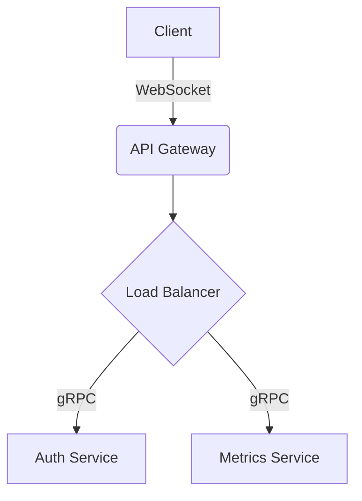

Today I focused on laying out the core dashboard foundation. The primary challenge was establishing a component architecture that feels premium, highly responsive, and avoids standard "admin template" aesthetics.

### Progress
- Established the `LiveBorderCard` component for dynamic metrics.
- Setup the core layout grid using CSS Grid and subgrid for perfect alignment.
- Implemented the `Heatmap` component for tracking metrics.

### Challenges
The SVG rendering for the animated borders caused significant issues with velocity consistency at the corners. WebKit normalizes `pathLength` unevenly.

### Solutions
I pivoted the architecture to a **GPU-accelerated Linear Mask Sweep**. By using a rotating CSS mask over a solid DOM border, I achieved mathematical perfection without relying on JavaScript or SVG parsing.

### Next Goal
Implement the authentication middleware and connect the real-time websocket stream to the frontend cards.

```typescript
export function LiveBorderCard({ children, className }: LiveBorderCardProps) {
  return (
    <div className={cn("group relative bg-[#111111] rounded-[12px]", className)}>
      <div className="absolute inset-0 rounded-[12px] border border-[#2A2A2A]" />
      <div className="absolute inset-0 rounded-[12px] border border-white animate-mask-sweep pointer-events-none" />
      <div className="relative z-10 h-full">
        {children}
      </div>
    </div>
  )
}
```


